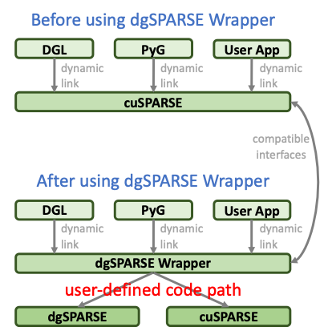

# dgSPARSE Wrapper

## Introduction

### General Introduction

The dgSPARSE Wrapper is an open-source project which compiles different sparse libraries and generates a unified sparse library. The generated sparse library exposes compatible interfaces to the NVIDIA cuSPARSE library. Users can also expose more interfaces than the NVIDIA cuSPARSE library with the dgSPARSE Wrapper project.

### How dgSPARSE Wrapper Works

The dgSPARSE Wrapper project generates a dynamic link library (libcusparsewrapper.so by default). By replacing libcusparse.so (cuSAPRSE dynamic link library), programs compiled with cuSAPRSE can link this library. During runtime, the library dynamically opens different sparse libraries (e.g., cuSPARSE, dgSPARSE, and etc.)

As shown in the figure, before using dgSPARSE Wrapper, programs and frameworks linking the cuSPARSE library calls corresponding APIs. 



## File Structure

```
.
├── bin: The folder which contains the generated dgSPARSE Wrapper library.
│   └── libdgsparsewrapper.so
├── example
│   └── dgl
├── include: The folder which contains necessary header files, including the symbol helper, the logger, and etc.
│   ├── common.h
│   ├── cuda-11.1: Header files of CUDA v11.1.
│   ├── dgsparse-0.1: Header files of dgSPARSE v0.1.
│   ├── logger.h
│   └── symbol_helper_cusparse.h
├── lib: The folder which contains sparse libraries to be used.
│   └── dgsparse.so
├── Makefile
├── README.md
└── src: The folder which contains CUDA interface implementations of dgSPARSE wrapper.
    ├── sparse_main.cc: All CUDA interface implementations. For a certain interface, users can modify the code to decide a specific implemenation from a given sparse library. Currently, all CUDA interfaces are based on CUDA v11.1.
    └── symbol_helper.cc
```

## Example

### Kernel Example

### Framework Example

Here we use a Graph Neural Networks (GCN) example based on [DGL](url=https://www.dgl.ai/). We use docker based on the dockerfile provided by DGL.

0. Generate dgSPARSE Wrapper

1. Build docker image
```bash
cd [path-to-dgSPARSE-Wrapper]/example/dgl/docker
wget https://data.dgl.ai/dataset/FB15k.zip -P install/
docker build -t dgl-gpu:torch-1.2.0-cu11 -f Dockerfile.ci_gpu_cu11 .
cd [path-to-dgSPARSE-Wrapper]
```

2. Run container
```bash
docker run -it --runtime=nvidia --rm \
-v [path-to-dgSPARSE-Wrapper]/example/dgl/gcn:/gcn \
-v [path-to-dgSPARSE-Wrapper]/bin:/dgsparsewrapper \
-v [path-to-dgSPARSE-Wrapper]/lib:/sparselib \
dgl-gpu:torch-1.2.0-cu11 \
/bin/bash

conda activate pytorch-ci
pip install dgl-cu111
```

3. Run GCN based on cuSPARSE
```bash
cd /gcn
python3 train.py --dataset cora --gpu 0 --self-loop
```

4. Run GCN based on dgSPARSE
```bash
cd /usr/local/cuda-11.1/lib64/
cp /dgsparsewrapper/libdgsparsewrapper.so ./
cp /sparselib/dgsparse.so ./
mv libcusparse.so.11.3.0.10 libcusparse.so.real # rename the original cuSPARSE
rm libcusparse.so.11
mv libdgsparsewrapper.so libcusparse.so.11 # use dgSPARSE Wrapper to replace cuSPARSE
cd /gcn
python3 train.py --dataset cora --gpu 0 --self-loop
```

## Milestone

The first version of dgSPARSE Wrapper is to be released on July, 2021.